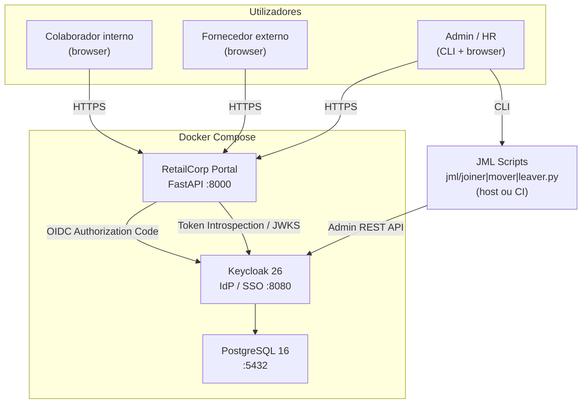
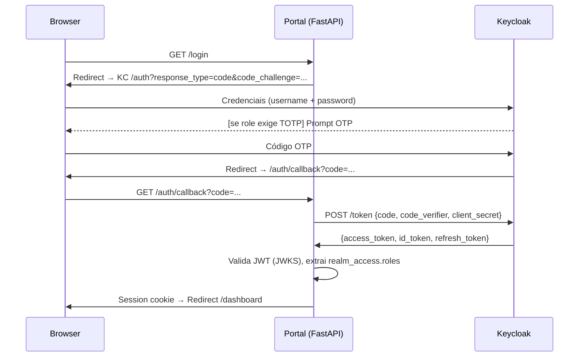
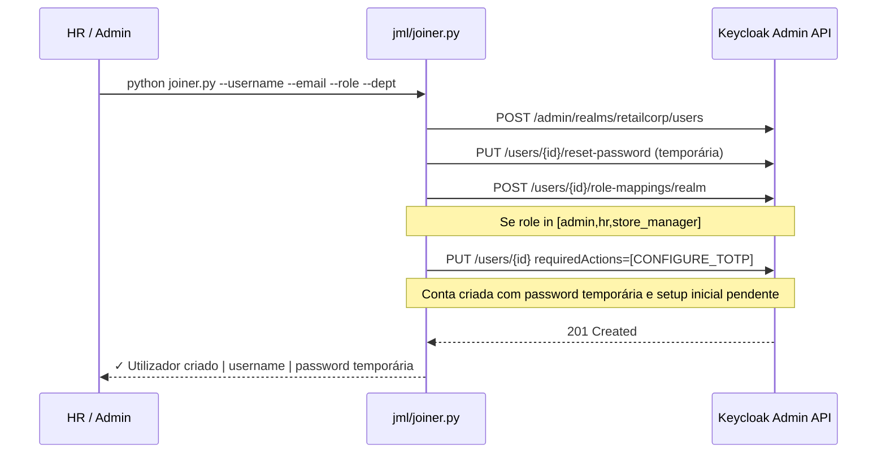
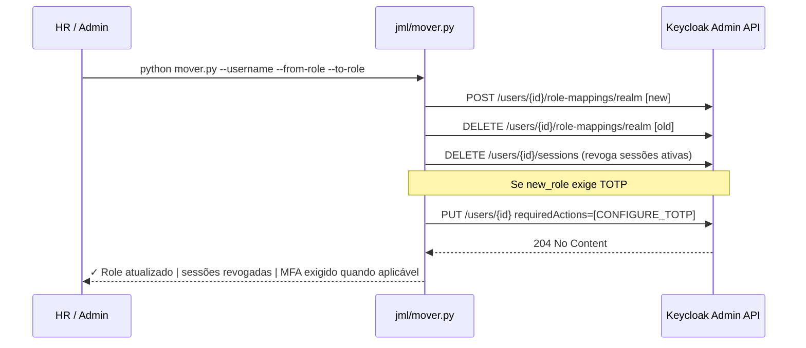
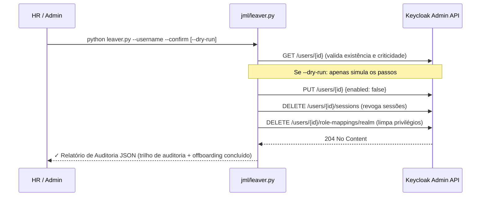
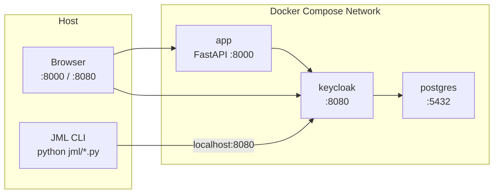

# Architecture — RetailCorp IAM

## Visão Geral

Solução IAM baseada em **Keycloak** como Identity Provider (IdP) central, com OIDC para a aplicação web e Admin REST API para os fluxos JML. Toda a infraestrutura corre em Docker Compose.

---

## Diagrama de Componentes



---

## Fluxo de Autenticação (OIDC Authorization Code + PKCE)



---

## Fluxo de Autorização

Após autenticação, o access token JWT contém:

```json
{
  "sub": "uuid-do-utilizador",
  "preferred_username": "joao.silva",
  "email": "joao.silva@retailcorp.local",
  "realm_access": {
    "roles": ["cashier", "default-roles-retailcorp"]
  }
}
```

A aplicação valida a presença dos roles necessários antes de servir cada rota protegida.

---

## Fluxos JML

### Joiner



### Mover



### Leaver (Offboarding Seguro)



---

## Modelo de Dados — Keycloak Realm

```
Realm: retailcorp
│
├── Roles (realm)
│   ├── admin
│   ├── hr
│   ├── store_manager
│   ├── cashier
│   ├── warehouse
│   └── supplier
│
├── Groups
│   ├── /it          → role: admin
│   ├── /hr          → role: hr
│   ├── /stores      → role: store_manager
│   ├── /warehouses  → role: warehouse
│   └── /suppliers   → role: supplier
│
├── Clients
│   └── retailcorp-portal (confidential, OIDC)
│       ├── Standard Flow: enabled
│       ├── Redirect URIs: http://localhost:8000/*
│       └── Scopes: openid, profile, email, roles
│
└── Events
    ├── User Events: LOGIN, LOGIN_ERROR, LOGOUT, UPDATE_TOTP, ...
    └── Admin Events: CREATE, UPDATE, DELETE (users, roles, sessions)
```

---

## Estratégia de Auditoria

Três níveis complementares de rasto de segurança:

| Nível | Origem | Conteúdo | Consulta |
|-------|--------|----------|---------|
| **Keycloak Events** | Keycloak (BD) | Login, logout, MFA, erros, alterações admin | Admin Console → Events |
| **App Audit Log** | FastAPI (ficheiro JSON) | Acessos a rotas protegidas, 403s | `/admin/audit` (role admin) |
| **JML Audit Trail** | Scripts CLI (Output/Log) | Detalhe operacional de Joiner/Mover/Leaver, incluindo setup pendente, revogação de sessões e bloqueio de login | Logs do sistema / Stdout |

### Política de Offboarding (Leaver)
Para garantir a conformidade e integridade dos dados históricos:
1. **Desativação Progressiva**: As contas nunca são apagadas (`DELETE_USER`), são apenas desativadas (`enabled: false`).
2. **Evidência Digital**: Cada operação gera um relatório JSON de auditoria com timestamp, operador e passos executados.
3. **Dry-Run**: Possibilidade de validar o impacto da desativação antes da execução real.
4. **Isolamento**: Remoção de roles para impedir acessos residuais, mantendo o histórico de auditoria no Keycloak.

### Eventos Keycloak configurados

- `LOGIN` / `LOGIN_ERROR`
- `LOGOUT` / `LOGOUT_ERROR`
- `UPDATE_TOTP` / `UPDATE_TOTP_ERROR` / `REMOVE_TOTP` / `REMOVE_TOTP_ERROR`
- `CODE_TO_TOKEN` / `CODE_TO_TOKEN_ERROR`
- `REFRESH_TOKEN` / `REFRESH_TOKEN_ERROR`
- `UPDATE_PASSWORD` / `UPDATE_PASSWORD_ERROR`
- Admin Events (com detalhes): `CREATE_USER`, `UPDATE_USER`, `DELETE_USER`, `UPDATE_ROLE_MAPPING`

---

## Infraestrutura



### Reprodutibilidade

- `docker compose up` arranca todos os serviços
- Keycloak importa automaticamente `keycloak/realm-export.json` na primeira execução
- Variáveis sensíveis em `.env` (ver `.env.example`)

---

## Decisões Técnicas

Ver [docs/decisions/ADR-001-tech-stack.md](decisions/ADR-001-tech-stack.md)
